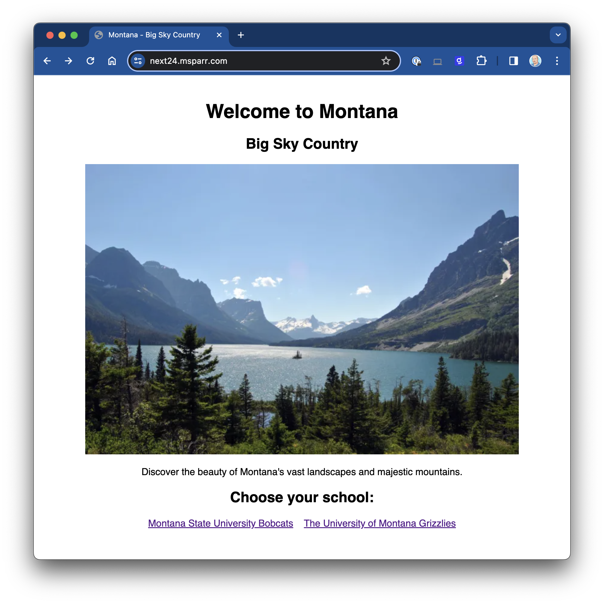

# Google Cloud Next '24 Demo
## Goodbye Ingress, Hello Gateway
This repo includes example code and YAML manifests for my Cloud Next '24 talk in 
Las Vegas, Nevada, USA on April 9, 2024.

In this demo, we explore limitations of Ingress (namespace-bound, etc.) and how to 
solve a common scenario using `Gateway` and `HTTPRoute` resources.

# Preview


# Architecture
TODO

# Google Cloud Infra Setup
Although I would advocate a repo or directory with infrastructure as code, run by CI/CD, 
this demo utilized `gcloud` SDK commands in the terminal as follows to set it up:

```bash
PROJECT_ID="next-24-demo"
IDNS=${PROJECT_ID}.svc.id.goog # workflow identity domain
PROJECT_USER=$(gcloud config get-value core/account) # set current user
GCP_REGION="us-west4"                    # CHANGEME (OPT)
GCP_ZONE="us-west4-a"                    # CHANGEME (OPT)
NETWORK_NAME="default"
STATIC_IP_NAME="next-demo-static-ip"
DOMAIN_NAME="next24.msparr.com"          # CHANGEME (OPT)
CERT_NAME="next24-msparr-com"            # CHANGEME (OPT)
CLUSTER_NAME="next-west"

# configure gcloud sdk
gcloud config set compute/region $GCP_REGION
gcloud config set compute/zone $GCP_ZONE

# create project
gcloud projects create $PROJECT_ID --folder $FOLDER \
    && linkbilling $PROJECT_ID \
    && gcloud config set project $PROJECT_ID

# enable apis
gcloud services enable compute.googleapis.com \
    storage.googleapis.com \
    artifactregistry.googleapis.com \
    certificatemanager.googleapis.com \
    cloudbuild.googleapis.com \
    container.googleapis.com \
    containersecurity.googleapis.com \
    secretmanager.googleapis.com

# provision static ip
gcloud compute addresses create $STATIC_IP_NAME --global
STATIC_IP=$(gcloud compute addresses describe $STATIC_IP_NAME \
    --format="value(address)" --global)
echo "Update DNS for $DOMAIN_NAME with static IP: $STATIC_IP"

# create certificate
gcloud compute ssl-certificates create $CERT_NAME \
    --domains="$DOMAIN_NAME,catsrule.msparr.com,grizrule.msparr.com" \
    --global

# create cluster
gcloud container clusters create $CLUSTER_NAME \
    --zone $GCP_ZONE \
    --num-nodes 2 \
    --enable-ip-alias \
    --enable-managed-prometheus \
    --enable-network-policy \
    --gateway-api standard
```
